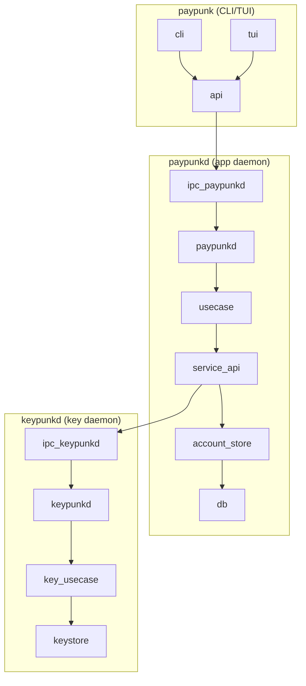

# Paypunk — Technical Specification

## 1. Architecture

### 1.1 Shape

Three-process architecture from v1:

- **`keypunkd`** — Long-running daemon hosting KeyActor. Responsible for key generation, signing, and proving. Runs as a separate system user for defense-in-depth. IPC auth is per-message HMAC using X25519 shared secret — any process can connect, but only a registered client with the correct keypair can send valid messages. Password is additionally required for `Unlock`. See ADR-001.
- **`paypunkd`** — Long-running daemon hosting WalletActor, usecases, and service orchestration. Exposes IPC over Unix domain socket. Never holds key material — delegates signing to `keypunkd`.
- **`paypunk`** — CLI binary. Connects to `paypunkd` over Unix socket for all operations. Includes TUI mode (ratatui) for interactive use. Uses `api` library which hides IPC details.

Rationale: Three-process separation enforces the security boundary — neither the CLI nor the application daemon ever hold key material. Only `keypunkd` does. The IPC tactix actor makes cross-process calls look like local actor messages, so the actor protocol is the same whether in-process or over the wire.



### 1.2 Stack

| Layer | Choice |
|-------|--------|
| Runtime | Rust (stable), Tokio async runtime |
| Actor framework | tactix |
| IPC | Unix domain socket (serde + postcard) |
| Database | SQLite via `zcash_client_sqlite` |
| gRPC client | lightwalletd via `zcash_client_backend` |
| TUI | ratatui |
| CLI args | clap |
| Encryption | Argon2id + HKDF |
| Key derivation | BIP39 (12-word mnemonic), BIP32/44 / ZIP 32 |

### 1.3 Repository Structure

```
paypunk/
├── api/                  # Chain-agnostic public API library (CLI/TUI depend on this)
│   └── src/
│       ├── lib.rs        # High-level functions, hides IPC/tactix from consumers
│       └── ...
├── paypunkd/             # Daemon binary: usecases, actors, service orchestration
│   └── src/
│       ├── usecases/     # Business logic functions
│       ├── actors/       # WalletActor
│       ├── services/     # Service trait definitions, chain injection
│       ├── server/       # Unix socket listener, request dispatch
│       └── main.rs
├── keypunkd/             # Daemon binary: key generation, signing, proving
│   └── src/
│       ├── actors/       # KeyActor
│       ├── key/          # Seed generation, derivation, encryption
│       ├── server/       # Unix socket listener
│       └── main.rs
├── ipc/                  # Tactix actor router for interprocess comms (library)
│   └── src/
│       ├── lib.rs        # Crate root, re-exports IpcMessage, IpcActor, IpcServer
│       ├── router.rs     # IpcActor: tactix actor wrapping a UnixStream (connect + send/recv)
│       ├── server.rs     # IpcServer: Unix socket listener, dispatches to handler actor
│       └── messages.rs   # IpcMessage type (tactix Message wrapping Vec<u8>)
├── chains/               # Chain-specific implementations
│   ├── zcash/            # Zcash: address derivation, LSP scanning, transfer construction
│   │   └── src/
│   │       ├── address.rs
│   │       ├── scanning.rs
│   │       ├── transfer.rs
│   │       └── balance.rs
│   └── ethereum/         # Ethereum: TBD
│       └── src/
├── tui/                  # Ratatui screens and widgets (library crate)
│   └── src/
│       ├── screens/      # Full-screen views (dashboard, send, history)
│       └── widgets/      # Reusable UI components
├── cli/                  # CLI binary (uses api)
│   └── src/
│       ├── commands/     # Subcommand implementations
│       ├── config/       # Config loading, socket path, endpoints
│       └── main.rs
└── tests/                # Integration tests
```

### 1.4 Daemon Lifecycle

- **Lazy start**: When any CLI command (e.g., `balance`, `send`, `sync`) is issued, the `api` library checks whether `paypunkd` is reachable on its Unix socket. If not, it spawns `paypunkd`, which in turn spawns `keypunkd`. The daemons remain running after the CLI exits.
- **Explicit stop**: `paypunk down` (aliased as `stop`) sends a graceful shutdown IPC message to `paypunkd`, which relays shutdown to `keypunkd`. Both daemons exit cleanly.
- **Crash recovery**: If a daemon has crashed, the next CLI command auto-starts it. No manual intervention needed.

### 1.5 Architecture Decision Records

| # | Title | Status |
|---|-------|--------|
| 1 | [IPC Authentication Model](adr/001-ipc-auth-model.md) | Accepted |

## 2. Data Model

### 2.1 Design Approach

Uniform chain-agnostic types. Data flowing through actors and IPC uses common-denominator primitives (strings, numbers, enums) rather than generic traits or type parameters. Chain-specific logic is encapsulated inside the actor implementations; the data model itself is blockchain-agnostic.

```rust
struct Address(String);              // "u1..." for Zcash, "0x..." for Ethereum
struct Amount(u64);                  // zatoshis / wei / satoshis
struct TransferId(String);           // tx hash hex
struct BlockHeight(u64);             // block number

struct Balance {
    spendable: Amount,
    pending: Amount,
    total: Amount,
}

enum TransactionStatus {
    Pending,
    Confirmed(BlockHeight),
    Failed(String),
}

struct Transfer {
    id: TransferId,
    from: Address,
    to: Address,
    amount: Amount,
    fee: Amount,
    memo: Option<String>,
    status: TransactionStatus,
    created_at: OffsetDateTime,
}
```

### 2.2 Domain Entities

| Entity | Key fields | Storage | Notes |
|--------|-----------|---------|-------|
| `Seed` | mnemonic (12 words), encrypted_blob, created_at | `seed.enc` file | Not in SQLite |
| `AccountBirthday` | birthday_height, sapling_frontier, orchard_frontier, recover_until | SQLite (`zcash_client_sqlite`) | Used for LSP scan start |
| `Account` | account_id (ZIP 32 index), ufvk | SQLite (`zcash_client_sqlite`) | Single account in v1 |
| `Address` | index, unified_address, diversifier, pool, account_id | SQLite | One per payment, never reused |
| `Transfer` | raw tx, outputs, fee, status, account_id | SQLite (`zcash_client_sqlite`) | Status: Pending → Confirmed → Failed |
| `IncomingPayment` | tx_id, amount, memo, block_height, pool | SQLite (`zcash_client_sqlite`) | Detected via LSP scan |
| `ScanState` | last_scanned_height, fully_scanned_height | SQLite (`zcash_client_sqlite`) | Managed by backend |

### 2.3 Database Schema

Managed by `zcash_client_sqlite`. Our code does not define the schema — it is created and migrated by the upstream crate. We interact via the `WalletRead`/`WalletWrite` traits.

### 2.4 State Machines

**Transfer**

- States: `Pending`, `Confirmed`, `Failed`
- Transitions:
  - `Pending` → `Confirmed`: guard = `mined in block`, side effect = `update balance`
  - `Pending` → `Failed`: guard = `chain rejection / timeout`, side effect = `release reserved funds`
- Invariants: INV-01: "a Transfer amount must never exceed the spendable balance at construction time"

### 2.5 Domain Invariants
- **INV-01**: A Transfer amount + fee must never exceed the spendable balance at construction time.
- **INV-02**: Addresses must never be reused for different Incoming Payments. *(Deferred to post-v1 — single-use addresses are the long-term goal, but address reuse is acceptable for the initial build.)*
- **INV-03**: The KeyActor must never expose raw key material — only signed/proved outputs.

## 3. Module Specification

### `api` crate

- **Responsibility**: Chain-agnostic public library that CLI and TUI depend on. Provides high-level functions (`get_balance`, `create_transfer`, `sync`, etc.) that accept an asset type parameter and dispatch to the appropriate chain backend. Hides IPC, tactix, and chain-specific details from consumers.
- **Dependencies**: `ipc`
- **Key interfaces**:
  ```rust
  // Consumers see only this — no IPC, no actors, no chain details.
  pub fn get_balance(asset: Asset) -> Result<Balance>;
  pub fn get_address(asset: Asset) -> Result<Address>;
  pub fn create_transfer(asset: Asset, to: Address, amount: Amount, memo: Option<String>) -> Result<Transfer>;
  pub fn sync(asset: Asset) -> Result<()>;
  pub fn get_history(asset: Asset) -> Result<Vec<Transfer>>;
  pub fn unlock(password: String) -> Result<()>;
  pub fn lock() -> Result<()>;
  ```

### `paypunkd` crate

- **Responsibility**: Long-running daemon. Hosts WalletActor, usecase functions, and service orchestration. Receives IPC from `api`, delegates signing to `keypunkd`.
- **Dependencies**: `ipc`, `chains`
- **Sub-modules**:

  #### `usecases`
  - **Responsibility**: Business logic functions that orchestrate service calls
  - **Key interfaces**:
    ```rust
    fn handle_get_balance(services: &ServiceApi) -> Result<Balance>;
    fn handle_get_address(services: &ServiceApi) -> Result<Address>;
    fn handle_create_transfer(services: &ServiceApi, to: Address, amount: Amount, memo: Option<String>) -> Result<Transfer>;
    fn handle_sync(services: &ServiceApi) -> Result<()>;
    ```

  #### `actors`
  - **Responsibility**: WalletActor definition, message types
  - **Dependencies**: `types`, `ipc`
  - **Key interfaces**:
    ```rust
    enum WalletActorMessage {
        GetBalance { resp: ReplyTo<Balance> },
        GetAddress { resp: ReplyTo<Address> },
        CreateTransfer { to: Address, amount: Amount, memo: Option<String>, resp: ReplyTo<Transfer> },
        Sync { resp: ReplyTo<()> },
        GetHistory { resp: ReplyTo<Vec<Transfer>> },
    }
    ```

  #### `services`
  - **Responsibility**: Service trait definitions and chain-specific injection. Abstracts chain backend so usecases are chain-agnostic.
  - **Key interfaces**:
    ```rust
    trait ChainService {
        fn derive_address(&self) -> Result<Address>;
        fn scan_blocks(&self, from: BlockHeight) -> Result<ScanResult>;
        fn build_transfer(&self, to: Address, amount: Amount, memo: Option<String>) -> Result<Proposal>;
        fn get_balance(&self) -> Result<Balance>;
    }
    ```

### `keypunkd` crate

- **Responsibility**: Long-running daemon. Hosts KeyActor. Only accepts IPC from `paypunkd`. Never exposes raw key material.
- **Dependencies**: `ipc`
- **Sub-modules**:

  #### `actors`
  - **Responsibility**: KeyActor definition, message types
  - **Key interfaces**:
    ```rust
    enum KeyActorMessage {
        Unlock { password: String },
        Lock,
        SignTransaction { proposal: Vec<u8> },
        Prove { proposal: Vec<u8> },
    }
    ```

  #### `key`
  - **Responsibility**: Seed generation, BIP39 mnemonic, Argon2id encryption/decryption, HKDF key splitting, ZIP 32 derivation
  - **Dependencies**: none (pure functions)
  - **Key interfaces**:
    ```rust
    fn generate_seed() -> Seed;
    fn encrypt_seed(seed: &Seed, password: &str) -> EncryptedSeed;
    fn decrypt_seed(encrypted: &EncryptedSeed, password: &str) -> Result<Seed>;
    fn derive_key(password: &str) -> (StorageKey, SeedKey);
    ```

### `ipc` crate

- **Responsibility**: Tactix actor that sends/receives raw bytes over Unix domain sockets. Serves as the transport layer between all processes. Both `api` and daemons use this crate. The `IpcActor` implements the same tactix `Handler<IpcMessage>` trait as any in-process actor, making cross-process calls referentially transparent with local ones.
- **Dependencies**: `tactix`, `tokio` (net + io-util), `thiserror`, `bytes`
- **Key interfaces**:
  ```rust
  /// Universal IPC message — raw bytes over the wire.
  /// Sender and receiver each handle their own serialization.
  #[derive(Message)]
  #[response(Result<Vec<u8>, String>)]
  struct IpcMessage(Vec<u8>);

  /// IPC actor — wraps a UnixStream as a tactix actor.
  /// Connect to a socket, send/receive length-prefixed frames.
  struct IpcActor { stream: UnixStream, read_buf: BytesMut }
  impl IpcActor {
      async fn connect(path: &str) -> Result<Addr<Self>, IpcError>;
  }
  impl Handler<IpcMessage> for IpcActor { /* write raw bytes, read response */ }

  /// Server — listens on a Unix socket and dispatches requests.
  struct IpcServer { listener: UnixListener }
  impl IpcServer {
      async fn bind(path: impl AsRef<Path>) -> Result<Self, IpcError>;
      async fn serve<H>(&self, handler: Addr<H>) -> Result<(), IpcError>
          where H: Actor + Handler<IpcMessage>;
  }
  ```
- **Wire format**: length-prefixed frames (4-byte LE length, then payload). Response prepends a status byte: `0` = success, `1` = error string.

### `chains/zcash` crate

- **Responsibility**: Zcash-specific logic — address derivation via ZIP 32, LSP chain scanning via `zcash_client_backend`, transfer construction, balance computation, lightwalletd gRPC connection.
- **Dependencies**: `ipc` (for types)
- **Critical logic**: Wraps `zcash_client_sqlite` traits (`WalletRead`/`WalletWrite`/`InputSource`), orchestrates scan → decrypt → witness → build → sign → broadcast pipeline. Implements `ChainService` trait from `paypunkd::services`.

### `chains/ethereum` crate

- **Responsibility**: Ethereum-specific logic. TBD.
- **Dependencies**: `ipc` (for types)
- **Status**: Scaffold only for v1. Implements `ChainService` trait.

### `cli` crate

- **Responsibility**: CLI binary. Uses `api` for all operations. No direct IPC or actor knowledge.
- **Dependencies**: `api`, `tui`
- **Subcommands**: `init`, `balance`, `address`, `send`, `history`, `sync`, `tui`, `down` (aliased as `stop`)

### `tui` crate

- **Responsibility**: Ratatui screens and widgets for interactive wallet management.
- **Dependencies**: `api`
- **Screens**: Dashboard (balance + recent transfers), Send form, History list, Sync status

## 4. Critical Logic

### 4.1 Concurrency Model

- **KeyActor (keypunkd)**: Sequential message processing (tactix mailbox). Single point for signing — serializes all `SignTransaction` and `Prove` requests. Never exposes raw key material.
- **WalletActor (paypunkd)**: Sequential message processing. Serializes SQLite access (handled by `zcash_client_sqlite` writer lock). Orchestrates scanning, balance tracking, transfer construction. Delegates signing to `keypunkd` via IPC.
- **IPC actor (ipc crate)**: Tactix actor wrapping each Unix socket connection. Serializes/deserializes messages with postcard. Routes requests to the appropriate daemon.
- **No shared mutable state** between processes — communication is message-passing over Unix sockets. No locks needed beyond SQLite's internal write lock.

### 4.2 Scan Pipeline (WalletActor)

1. Connect to lightwalletd gRPC endpoint (round-robin with fallback across configured endpoints)
2. Fetch chain tip height from lightwalletd
3. Determine unscanned block range from `ScanState` (persisted in SQLite)
4. Download compact blocks for the unscanned range
5. Trial-decrypt each block with the account's `UnifiedFullViewingKey`
6. Update note commitment trees (Sapling + Orchard frontiers)
7. Detect and handle reorgs (truncate to last valid height)
8. Update `WalletSummary` with new per-account balances
9. Persist updated `ScanState`

### 4.3 Key Lifecycle (KeyActor)

1. `Unlock` → read `seed.enc` → Argon2id derive decryption key → decrypt seed → derive `UnifiedSpendingKey` via ZIP 32 → hold in protected memory (mlock, mprotect)
2. `SignTransaction` → sign with USK → return signature bytes
3. `Prove` → generate zk-SNARK proof → return proof bytes
4. `Lock` → zero memory (memset + mlock advisory) → drop USK

### 4.4 IPC Request Flow

```
CLI → api → ipc (postcard) → paypunkd dispatcher → WalletActor message
                                                                → (if sign needed) ipc → keypunkd → KeyActor message
                                                                → response → api → CLI
```

## 5. API Contracts

### 5.1 Internal Module Interfaces

Covered in Section 3 (Module Specification) above. Key interfaces are the actor message types (`KeyActorMessage`, `WalletActorMessage`) and the IPC request/response types (`IpcRequest`, `IpcResponse`).

### 5.2 External API Endpoints

None. All interaction is via Unix domain socket IPC. The CLI is the user-facing interface.

## 6. Build Sequence

### Step 1: Core types + IPC tactix protocol
- **What to implement**: `ipc` crate with raw-bytes message type (`IpcMessage`), tactix IPC actor wrapping a Unix socket (`IpcActor`), server connection handler (`IpcServer`), length-prefixed frame wire format with success/error status byte. Serialization is left to the caller — the IPC layer is purely a transport.
- **Validation checkpoint**: can connect two processes over Unix socket, send a message, get a response (9 tests passing: echo, binary, large messages, error handling, referential transparency)
- **Dependencies**: none

### Step 2: api scaffold
- **What to implement**: `api` crate with high-level public API functions. Internally calls `paypunkd` via the `ipc` crate. CLI and TUI depend only on this crate.
- **Validation checkpoint**: `cargo test` passes, API compiles
- **Dependencies**: Step 1

### Step 3: keypunkd daemon
- **What to implement**: `keypunkd` crate. KeyActor, key module (seed generation, BIP39, Argon2id encrypt/decrypt, HKDF split, ZIP 32 derivation). Unix socket listener, IPC dispatch.
- **Validation checkpoint**: daemon starts, accepts IPC, responds to Unlock/Lock/Sign
- **Dependencies**: Step 1

### Step 4: paypunkd daemon — usecases + services
- **What to implement**: `paypunkd` crate. Usecase functions (handle_get_balance, handle_create_transfer, etc.), service trait definitions (ChainService), WalletActor, service locator/injection for chain backends. Unix socket listener.
- **Validation checkpoint**: daemon starts, accepts IPC, routes requests to WalletActor and keypunkd
- **Dependencies**: Step 1, Step 3

### Step 5: chains/zcash integration
- **What to implement**: `chains/zcash` crate wrapping `zcash_client_backend`/`zcash_client_sqlite`. Implements ChainService trait. Address derivation via ZIP 32, LSP chain scanning, transfer construction, balance computation.
- **Validation checkpoint**: can sync with Zcash testnet, get balance, create a transfer
- **Dependencies**: Step 4

### Step 6: CLI commands
- **What to implement**: `cli` crate with clap subcommands: `init`, `balance`, `address`, `send`, `history`, `sync`, `tui`; password input modes (interactive prompt, env var, secrets file)
- **Validation checkpoint**: each command works end-to-end against running paypunkd + keypunkd
- **Dependencies**: Step 2, Step 5

### Step 7: TUI
- **What to implement**: `tui` crate with ratatui screens (Dashboard with balance + recent transfers, Send form, History list, Sync status indicator); background polling loop for wallet updates
- **Validation checkpoint**: interactive wallet management works in terminal
- **Dependencies**: Step 6

### Step 8: Polish
- **What to implement**: Error handling refinement, structured logging (tracing), config file, documentation, integration tests
- **Validation checkpoint**: manual QA pass across all commands
- **Dependencies**: Step 7

### Build Checklist

| # | Step | Status |
|---|------|--------|
| 1 | Core types + IPC tactix protocol (`ipc` crate) | ✅ Done |
| 2 | `api` scaffold | ☐ Pending |
| 3 | `keypunkd` daemon | ☐ Pending |
| 4 | `paypunkd` daemon — usecases + services | ☐ Pending |
| 5 | `chains/zcash` integration | ☐ Pending |
| 6 | CLI commands | ☐ Pending |
| 7 | TUI | ☐ Pending |
| 8 | Polish | ☐ Pending |

### Deferred (post-v1)
- Tauri desktop app
- Multi-account support
- FROST multi-signature / agent approval workflows
- OS keyring integration
- chains/ethereum implementation
- Address reuse policy enforcement (INV-02)
- Agent-to-agent commerce flows
- n8n integration and merchant invoicing tools (sister project)

## 7. Testing Strategy

- **Unit tests**: `key` module (seed gen/validation, encrypt/decrypt roundtrip, HKDF correctness), `zcash` module (address derivation determinism, balance computation)
- **Integration tests**: IPC protocol (connect daemon, send/receive messages), Zcash sync (testnet scanning)
- **E2E tests**: Full CLI command flows against a running daemon on testnet
- **Coverage targets**: 80%+ on `key` module, 70%+ on `zcash` module, smoke tests on CLI + daemon

## 8. Error Handling

- **Hierarchy**: Top-level `Error` enum in `api` with module-specific variants (KeyError, WalletError, IpcError). Chain-specific errors are handled within their respective crates and surfaced as typed variants.
- **Propagation**: Actors return `Result<T, Error>` through ReplyTo channels. IPC layer serializes errors as `IpcResponse::Error(String)`.
- **UI handling**: CLI formats errors as stderr messages. TUI shows error dialogs.

## 9. Security

- **Auth model**: Per-message HMAC using X25519 shared secret between process keypairs. Client registers its public key on connect; every subsequent message is authenticated with an HMAC tag derived from the DH shared secret. Password is additionally required for `Unlock`. See ADR-001.
- **Secrets management**: Seed encrypted with Argon2id in `seed.enc`. KeyActor holds decrypted key in mlocked memory. Password sourced from stdin, env var, or secrets file.
- **Data protection**: SQLite wallet state encrypted with separate HKDF-derived key. Socket file permissions restricted to owner.
- **Rate limiting**: Not applicable for v1 (local Unix socket, single user).

## 10. Observability

- **Logging**: Structured logging via `tracing`. Info-level for operations (sync start/complete, transfer created), debug-level for scan details, warn/error for failures.
- **Metrics**: Deferred to post-v1.
- **Alerts**: Not applicable for v1.

## 11. CI/CD

- **Pipeline**: lint (clippy) → typecheck → test (unit + integration) → build (release)
- **Environments**: dev (local cargo), CI (GitHub Actions), release (crates.io + GitHub Releases)
- **Migrations**: SQLite schema managed by `zcash_client_sqlite` migrations — no custom migration tooling needed.

## 12. Open Questions

- Which Zcash network for default? Mainnet or testnet?
- How to handle proving parameters? Download on first use or bundle?
- Single account or configurable account count for v1?
- Exact lightwalletd endpoints to ship as defaults?
- How should domain entities (Address, Amount, Transfer) be extended for Ethereum? Same types with different validation, or chain-specific subtypes?
- What's the Ethereum equivalent of LSP scanning? (e.g., RPC polling, WebSocket subscriptions, The Graph?)
- How does the `ChainService` trait need to differ between UTXO (Zcash) and account-based (Ethereum) models?
