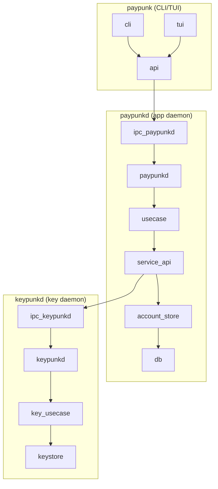

# Paypunk — Technical Specification

## 1. Architecture

### 1.1 Shape

Three-process architecture from v1:

- **`keypunkd`** — Long-running daemon hosting KeyActor. Responsible for key generation, signing, and proving. Runs as a separate system user for defense-in-depth. IPC auth is per-message HMAC using X25519 shared secret — any process can connect, but only a registered client with the correct keypair can send valid messages. Password is additionally required for `Unlock`. See ADR-001.
- **`paypunkd`** — Long-running daemon hosting WalletActor, usecases, and service orchestration. Exposes IPC over Unix domain socket. Never holds key material — delegates signing to `keypunkd`.
- **`paypunk`** — CLI binary. Connects to `paypunkd` over Unix socket for all operations. Includes TUI mode (ratatui) for interactive use. Uses `api` library which hides IPC details.

Rationale: Three-process separation enforces the security boundary — neither the CLI nor the application daemon ever hold key material. Only `keypunkd` does. The IPC tactix actor makes cross-process calls look like local actor messages, so the actor protocol is the same whether in-process or over the wire.



### 1.2 Stack

| Layer | Choice |
|-------|--------|
| Runtime | Rust (stable), Tokio async runtime |
| Actor framework | tactix |
| IPC | Unix domain socket (serde + postcard), X25519 per-message HMAC auth |
| Database | SQLite via `zcash_client_sqlite` (planned) |
| gRPC client | lightwalletd via `zcash_client_backend` (planned) |
| TUI | ratatui (planned) |
| CLI args | clap |
| Encryption | Argon2id + AES-256-GCM (seed), X25519 + AES-256-GCM (wire) |
| Key derivation | BIP39 (12-word mnemonic) |
| Logging | tracing + tracing-subscriber (env-filter) |

### 1.3 Repository Structure

```
paypunk/
├── types/                # Chain-agnostic domain types (library)
│   └── src/
│       └── lib.rs        # Address, Amount, Balance, Transfer, etc.
├── api/                  # Chain-agnostic public API library (CLI/TUI depend on this)
│   └── src/
│       ├── lib.rs        # Re-exports Client, functions
│       ├── client.rs     # Client: connects to paypunkd, wraps PaypunkService
│       └── functions.rs  # High-level functions (generate_seed)
├── paypunkd/             # Daemon binary: usecases, actors, service orchestration
│   └── src/
│       ├── lib.rs        # Crate root, re-exports modules
│       ├── main.rs       # CLI entry point, daemon bootstrap
│       ├── messages.rs   # PaypunkdRequest, PaypunkdResponse types
│       ├── dispatcher.rs # Tactix actor: deserialize → forward to keypunkd → serialize
│       ├── services.rs   # PaypunkService wrapping Recipient<IpcMessage>
│       └── usecases.rs   # Business logic: get_keypunk_public_key, generate_seed
├── keypunkd/             # Daemon binary: key generation, signing, proving
│   └── src/
│       ├── lib.rs        # Crate root, re-exports public modules
│       ├── main.rs       # CLI entry point, daemon bootstrap
│       ├── messages.rs   # KeypunkdRequest, KeypunkdResponse types
│       ├── dispatcher.rs # Tactix actor: deserialize → dispatch → serialize, session mgmt
│       ├── key.rs        # Seed generation, BIP39, Argon2id encrypt/decrypt
│       ├── crypto.rs     # X25519 Keypair for encrypted IPC exchange
│       ├── services.rs   # KeypunkService wrapping Recipient<IpcMessage>
│       ├── usecases.rs   # Business logic: generate_seed (decrypt → gen → encrypt → persist)
│       ├── errors.rs     # GenerateError enum
│       └── seed_store.rs # SeedStore trait, FilesystemSeedStore, InMemorySeedStore
├── ipc/                  # Tactix actor sender for interprocess comms (library)
│   └── src/
│       ├── lib.rs        # Crate root, re-exports IpcMessage, IpcSender, IpcReceiver, IpcError
│       ├── transport.rs  # UnixSocketTransport: framed read/write over UnixStream
│       ├── sender.rs     # IpcSender: tactix actor wrapping a transport (connect + send/recv)
│       ├── receiver.rs   # IpcReceiver: Unix socket listener, dispatches to handler actor
│       └── messages.rs   # IpcMessage type (tactix Message), wire protocol type bytes
├── cli/                  # CLI binary (uses api)
│   └── src/
│       └── main.rs       # Subcommand: generate-seed
├── tests/                # Integration tests (future)
├── adr/                  # Architecture Decision Records
│   └── 001-ipc-auth-model.md
├── PRD.md
├── SPEC.md
└── CONTEXT.md
```

### 1.4 Daemon Lifecycle

- **Lazy start**: When any CLI command (e.g., `balance`, `send`, `sync`) is issued, the `api` library checks whether `paypunkd` is reachable on its Unix socket. If not, it spawns `paypunkd`, which in turn spawns `keypunkd`. The daemons remain running after the CLI exits.
- **Explicit stop**: `paypunk down` (aliased as `stop`) sends a graceful shutdown IPC message to `paypunkd`, which relays shutdown to `keypunkd`. Both daemons exit cleanly.
- **Crash recovery**: If a daemon has crashed, the next CLI command auto-starts it. No manual intervention needed.

### 1.5 Architecture Decision Records

| # | Title | Status |
|---|-------|--------|
| 1 | [IPC Authentication Model](adr/001-ipc-auth-model.md) | Accepted |

## 2. Data Model

### 2.1 Design Approach

Uniform chain-agnostic types. Data flowing through actors and IPC uses common-denominator primitives (strings, numbers, enums) rather than generic traits or type parameters. Chain-specific logic is encapsulated inside the actor implementations; the data model itself is blockchain-agnostic.

```rust
struct Address(String);              // "u1..." for Zcash, "0x..." for Ethereum
struct Amount(u64);                  // zatoshis / wei / satoshis
struct TransferId(String);           // tx hash hex
struct BlockHeight(u64);             // block number

struct Balance {
    spendable: Amount,
    pending: Amount,
    total: Amount,
}

enum TransactionStatus {
    Pending,
    Confirmed(BlockHeight),
    Failed(String),
}

struct Transfer {
    id: TransferId,
    from: Address,
    to: Address,
    amount: Amount,
    fee: Amount,
    memo: Option<String>,
    status: TransactionStatus,
    created_at: u64,                     // Unix timestamp
}
```

### 2.2 Domain Entities

| Entity | Key fields | Storage | Notes |
|--------|-----------|---------|-------|
| `Seed` | mnemonic (12 words), encrypted_blob, created_at | `seed.enc` file | Not in SQLite |
| `AccountBirthday` | birthday_height, sapling_frontier, orchard_frontier, recover_until | SQLite (`zcash_client_sqlite`) | Used for LSP scan start |
| `Account` | account_id (ZIP 32 index), ufvk | SQLite (`zcash_client_sqlite`) | Single account in v1 |
| `Address` | index, unified_address, diversifier, pool, account_id | SQLite | One per payment, never reused |
| `Transfer` | raw tx, outputs, fee, status, account_id | SQLite (`zcash_client_sqlite`) | Status: Pending → Confirmed → Failed |
| `IncomingPayment` | tx_id, amount, memo, block_height, pool | SQLite (`zcash_client_sqlite`) | Detected via LSP scan |
| `ScanState` | last_scanned_height, fully_scanned_height | SQLite (`zcash_client_sqlite`) | Managed by backend |

### 2.3 Database Schema

Managed by `zcash_client_sqlite`. Our code does not define the schema — it is created and migrated by the upstream crate. We interact via the `WalletRead`/`WalletWrite` traits.

### 2.4 State Machines

**Transfer**

- States: `Pending`, `Confirmed`, `Failed`
- Transitions:
  - `Pending` → `Confirmed`: guard = `mined in block`, side effect = `update balance`
  - `Pending` → `Failed`: guard = `chain rejection / timeout`, side effect = `release reserved funds`
- Invariants: INV-01: "a Transfer amount must never exceed the spendable balance at construction time"

### 2.5 Domain Invariants
- **INV-01**: A Transfer amount + fee must never exceed the spendable balance at construction time.
- **INV-02**: Addresses must never be reused for different Incoming Payments. *(Deferred to post-v1 — single-use addresses are the long-term goal, but address reuse is acceptable for the initial build.)*
- **INV-03**: The KeyActor must never expose raw key material — only signed/proved outputs.

## 3. Module Specification

### `api` crate

- **Responsibility**: Chain-agnostic public library that CLI and TUI depend on. Provides high-level functions (`generate_seed`, etc.) that accept an asset type parameter and dispatch to the appropriate chain backend. Hides IPC, tactix, and chain-specific details from consumers.
- **Dependencies**: `paypunkd`, `keypunkd`, `paypunk-ipc`, `tactix`, `zeroize`
- **Key interfaces**:
  ```rust
  pub struct Client { service: PaypunkService }
  impl Client {
      pub async fn connect(socket_path: &str) -> Result<Self, String>;
      pub async fn generate_seed(&self, password: Zeroizing<String>) -> Result<Zeroizing<String>, String>;
  }
  ```

### `paypunkd` crate

- **Responsibility**: Long-running daemon. Hosts dispatcher actor, usecase functions, and service orchestration. Receives IPC from `api`, delegates signing/key operations to `keypunkd`.
- **Dependencies**: `paypunk-ipc`, `keypunkd`, `tactix`, `tokio`, `serde`/`postcard`, `clap`, `thiserror`, `tracing`, `tracing-subscriber`
- **Sub-modules**:

  #### `messages`
  - **Responsibility**: Request/response types serialized over IPC
  - **Key interfaces**:
    ```rust
    #[derive(Serialize, Deserialize)]
    enum PaypunkdRequest {
        GetKeypunkPublicKey,
        GenerateSeed { encrypted_password: Vec<u8>, client_public_key: [u8; 32] },
    }

    #[derive(Serialize, Deserialize)]
    enum PaypunkdResponse {
        KeypunkPublicKey { key: [u8; 32] },
        SeedGenerated { encrypted_mnemonic: Vec<u8> },
        Error { message: String },
    }
    ```

  #### `dispatcher`
  - **Responsibility**: Tactix actor receiving IPC messages, deserializing requests, forwarding to keypunkd via `KeypunkService`, serializing responses

  #### `services`
  - **Responsibility**: `PaypunkService` wrapping a `Recipient<IpcMessage>` for IPC calls to keypunkd

  #### `usecases`
  - **Responsibility**: Business logic functions that orchestrate service calls
  - **Key interfaces**:
    ```rust
    pub async fn get_keypunk_public_key(service: &KeypunkService) -> Result<[u8; 32], String>;
    pub async fn generate_seed(service: &KeypunkService, encrypted_password: Vec<u8>, client_public_key: [u8; 32]) -> Result<Vec<u8>, String>;
    ```

### `keypunkd` crate

- **Responsibility**: Long-running daemon. Hosts the dispatcher actor for key operations. Only accepts IPC from `paypunkd`. Never exposes raw key material.
- **Dependencies**: `paypunk-ipc`, `tactix`, `tokio`, `serde`/`postcard`, `bip39`, `argon2`, `aes-gcm`, `x25519-dalek`, `blake2`, `rand`, `clap`, `thiserror`, `zeroize`, `tracing`, `tracing-subscriber`
- **Sub-modules**:

  #### `messages`
  - **Responsibility**: Request/response types serialized over IPC
  - **Key interfaces**:
    ```rust
    #[derive(Serialize, Deserialize)]
    enum KeypunkdRequest {
        GetPublicKey,
        GenerateSeed {
            encrypted_password: Vec<u8>,    // AES-GCM encrypted to keypunkd's public key
            client_public_key: [u8; 32],     // Client's ephemeral X25519 public key
        },
    }

    #[derive(Serialize, Deserialize)]
    enum KeypunkdResponse {
        PublicKey { key: [u8; 32] },
        SeedGenerated {
            encrypted_mnemonic: Vec<u8>,    // Mnemonic encrypted to client's public key
        },
        Error { message: String },
    }
    ```

  #### `key`
  - **Responsibility**: Seed generation, BIP39 mnemonic, Argon2id encryption/decryption
  - **Dependencies**: none (pure functions)
  - **Key interfaces**:
    ```rust
    fn generate_seed() -> ([u8; 64], String);    // (512-bit seed, 12-word mnemonic)
    fn derive_key(password: &str, salt: &[u8]) -> [u8; 32];  // Argon2id
    fn encrypt_seed(seed: &[u8; 64], password: &str) -> Result<Vec<u8>>;
    ```

  #### `crypto`
  - **Responsibility**: X25519 keypair for encrypted IPC exchange. Used by both the server (keypunkd) and client (api/paypunkd) to encrypt/decrypt secrets over the wire.
  - **Key interfaces**:
    ```rust
    struct Keypair { /* X25519 secret + public */ }
    impl Keypair {
        fn new() -> Self;
        fn public_key(&self) -> [u8; 32];
        fn keypair(&self) -> ([u8; 32], [u8; 32]);     // (secret, public)
        fn encrypt<T: Zeroize + AsRef<[u8]>>(&self, secret_message: Zeroizing<T>, peer_pk: &[u8; 32]) -> Vec<u8>;
        fn decrypt(&self, encrypted: &[u8], peer_pk: &[u8; 32]) -> Result<Zeroizing<String>, CryptoError>;
    }
    ```

  #### `seed_store`
  - **Responsibility**: Persistence abstraction for the encrypted seed blob
  - **Key interfaces**:
    ```rust
    trait SeedStore {
        fn write(&self, blob: &[u8]) -> Result<(), SeedStoreError>;
    }

    struct FilesystemSeedStore { path: PathBuf }   // Atomic write to seed.enc
    struct InMemorySeedStore { blob: Mutex<Option<Vec<u8>>> }  // For testing
    ```

  #### `dispatcher`
  - **Responsibility**: Tactix actor receiving IPC messages, deserializing requests, dispatching to key/crypto/seed_store modules. Verifies sender authentication — rejects in-process messages (`sender_public_key` is `None`) unless `skip_session_auth` is enabled (for tests).
  - **Generic over**: `S: Storage` (any SeedStore implementation)
  - **Key behavior**:
    ```rust
    struct Dispatcher<S: Storage> {
        keystore: Keypair,
        seed_store: S,
        session: Option<[u8; 32]>,
        skip_session_auth: bool,
    }
    ```
    - `verify_message`: Rejects messages where `sender_public_key` is `None` (in-process) unless `skip_session_auth` is set.
    - `set_session`: On successful password-authenticated requests, records the sender's public key.

### `ipc` crate

- **Responsibility**: Tactix actor that sends/receives raw bytes over Unix domain sockets. Serves as the transport layer between all processes. Both `api` and daemons use this crate. The `IpcSender` implements the same tactix `Handler<IpcMessage>` trait as any in-process actor, making cross-process calls referentially transparent with local ones. Includes built-in X25519-based per-message authentication (see ADR-001).
- **Dependencies**: `tactix`, `tokio` (net + io-util), `thiserror`, `bytes`, `x25519-dalek`, `blake2`, `rand`, `tracing`
- **Key interfaces**:
  ```rust
  /// Universal IPC message — raw bytes over the wire.
  /// Sender and receiver each handle their own serialization.
  /// `sender_public_key` is populated by the receiver with the
  /// client's X25519 public key from the IPC handshake.
  #[derive(Message)]
  #[response(Result<Vec<u8>, String>)]
  struct IpcMessage {
      payload: Vec<u8>,
      sender_public_key: Option<[u8; 32]>,
  }

  /// Low-level transport: framed reads/writes over UnixStream.
  struct UnixSocketTransport { stream: UnixStream, read_buf: BytesMut }
  impl UnixSocketTransport {
      async fn connect(path: &str) -> Result<Self, IpcError>;
      fn from_stream(stream: UnixStream) -> Self;
      async fn read_frame(&mut self) -> Result<Vec<u8>, IpcError>;
      async fn write_frame(&mut self, data: &[u8]) -> Result<(), IpcError>;
  }

  /// IPC client actor — wraps a transport as a tactix actor.
  /// Connect to a socket, perform X25519 handshake, send/receive authenticated frames.
  struct IpcSender { transport: UnixSocketTransport, hmac_key: [u8; 32] }
  impl IpcSender {
      async fn connect(path: &str) -> Result<Addr<Self>, IpcError>;
  }
  impl Handler<IpcMessage> for IpcSender { /* compute MAC, write type byte + payload + MAC, read response */ }

  /// Server — listens on a Unix socket and dispatches requests.
  struct IpcReceiver { listener: UnixListener, secret: [u8; 32], public: [u8; 32] }
  impl IpcReceiver {
      async fn bind(path: impl AsRef<Path>) -> Result<Self, IpcError>;
      fn new(listener: UnixListener, secret: [u8; 32], public: [u8; 32]) -> Self;
      fn public_key(&self) -> [u8; 32];
      async fn serve<H>(&self, handler: Addr<H>) -> Result<(), IpcError>
          where H: Actor + Handler<IpcMessage>;
  }
  ```
- **Wire format**: length-prefixed frames (4-byte LE length, then payload). Each frame starts with a type byte:
  - `0x00` = MSG_GET_PUBLIC_KEY (client requests server's public key)
  - `0x01` = MSG_PUBLIC_KEY (server responds with its public key)
  - `0x02` = MSG_REGISTER_CLIENT (client registers its public key)
  - `0x03` = MSG_REGISTER_CLIENT_ACK (server acknowledges registration)
  - `0x04` = MSG_APPLICATION (authenticated application payload, followed by 32-byte HMAC tag)
- **Response prepends a status byte**: `0` = success, `1` = error string.

### `protocols/zcash` crate (planned)

- **Responsibility**: Zcash-specific logic — address derivation via ZIP 32, LSP chain scanning via `zcash_client_backend`, transfer construction, balance computation, lightwalletd gRPC connection.
- **Dependencies**: `paypunk-ipc` (for types)
- **Critical logic**: Wraps `zcash_client_sqlite` traits (`WalletRead`/`WalletWrite`/`InputSource`), orchestrates scan → decrypt → witness → build → sign → broadcast pipeline. Implements `ChainService` trait from `paypunkd::services`.

### `protocols/ethereum` crate (planned)

- **Responsibility**: Ethereum-specific logic. TBD.
- **Dependencies**: `paypunk-ipc` (for types)
- **Status**: Not yet implemented.

### `cli` crate

- **Responsibility**: CLI binary. Uses `api` for all operations. No direct IPC or actor knowledge.
- **Dependencies**: `paypunk-api`, `tokio`, `clap`, `zeroize`
- **Subcommands**: `generate-seed` (initializes wallet)

### `tui` crate (planned)

- **Responsibility**: Ratatui screens and widgets for interactive wallet management.
- **Dependencies**: `api`
- **Status**: Not yet implemented.

## 4. Critical Logic

### 4.1 Concurrency Model

- **KeyActor (keypunkd)**: Sequential message processing (tactix mailbox). Single point for signing — serializes all `SignTransaction` and `Prove` requests. Never exposes raw key material.
- **WalletActor (paypunkd)**: Sequential message processing. Serializes SQLite access (handled by `zcash_client_sqlite` writer lock). Orchestrates scanning, balance tracking, transfer construction. Delegates signing to `keypunkd` via IPC.
- **IPC actor (ipc crate)**: Tactix actor wrapping each Unix socket connection. Serializes/deserializes messages with postcard. Routes requests to the appropriate daemon.
- **No shared mutable state** between processes — communication is message-passing over Unix sockets. No locks needed beyond SQLite's internal write lock.

### 4.2 Scan Pipeline (WalletActor)

1. Connect to lightwalletd gRPC endpoint (round-robin with fallback across configured endpoints)
2. Fetch chain tip height from lightwalletd
3. Determine unscanned block range from `ScanState` (persisted in SQLite)
4. Download compact blocks for the unscanned range
5. Trial-decrypt each block with the account's `UnifiedFullViewingKey`
6. Update note commitment trees (Sapling + Orchard frontiers)
7. Detect and handle reorgs (truncate to last valid height)
8. Update `WalletSummary` with new per-account balances
9. Persist updated `ScanState`

### 4.3 Key Lifecycle (KeyActor)

1. `Unlock` → read `seed.enc` → Argon2id derive decryption key → decrypt seed → derive `UnifiedSpendingKey` via ZIP 32 → hold in protected memory (mlock, mprotect)
2. `SignTransaction` → sign with USK → return signature bytes
3. `Prove` → generate zk-SNARK proof → return proof bytes
4. `Lock` → zero memory (memset + mlock advisory) → drop USK

### 4.4 IPC Request Flow

```
CLI → api → ipc (postcard) → paypunkd dispatcher → WalletActor message
                                                                → (if sign needed) ipc → keypunkd → KeyActor message
                                                                → response → api → CLI
```

## 5. API Contracts

### 5.1 Internal Module Interfaces

Covered in Section 3 (Module Specification) above. Key interfaces are the actor message types (`KeyActorMessage`, `WalletActorMessage`) and the IPC request/response types (`IpcRequest`, `IpcResponse`).

### 5.2 External API Endpoints

None. All interaction is via Unix domain socket IPC. The CLI is the user-facing interface.

## 6. Build Sequence

### Step 1: Core types + IPC tactix protocol
- **What to implement**: `types` crate with chain-agnostic domain types (`Address`, `Amount`, `Balance`, `Transfer`, etc.). `ipc` crate with raw-bytes message type (`IpcMessage`), tactix IPC actor wrapping a Unix socket (`IpcSender`), server connection handler (`IpcReceiver`), X25519-based per-message authentication handshake (GetPublicKey → RegisterClient → derive HMAC key), length-prefixed frame wire format with type bytes and success/error status byte. Serialization is left to the caller — the IPC layer is purely a transport.
- **Validation checkpoint**: can connect two processes over Unix socket, send a message, get a response (9 tests passing: echo, binary, large messages, error handling, referential transparency)
- **Dependencies**: none

### Step 2: api + paypunkd + CLI scaffold
- **What to implement**: `api` crate with high-level public API functions, `paypunkd` daemon with dispatcher/services/usecases, `cli` binary with `generate-seed` command. Internally calls `paypunkd` via the `ipc` crate, which forwards to `keypunkd`. CLI and TUI depend only on `api`.
- **Validation checkpoint**: `cargo build` compiles, daemons start and accept IPC, end-to-end `generate-seed` flow works
- **Dependencies**: Step 1, Step 3

### Step 3: keypunkd daemon
- **What to implement**: `keypunkd` crate. Dispatcher actor, messages module (`KeypunkdRequest`/`KeypunkdResponse`), key module (seed generation via BIP39, Argon2id + AES-256-GCM encryption), crypto module (X25519 KeyStore + CryptoSession for encrypted password/mnemonic exchange), seed_store module (`SeedStore` trait with `FilesystemSeedStore` and `InMemorySeedStore`), Unix socket listener with `IpcReceiver::new()` sharing the KeyStore keypair.
- **Validation checkpoint**: daemon starts, accepts IPC, responds to GetPublicKey and GenerateSeed with encrypted password roundtrip (8 unit tests + 3 integration tests passing)
- **Dependencies**: Step 1

### Step 4: paypunkd daemon — usecases + services
- **What to implement**: `paypunkd` crate. Usecase functions (get_keypunk_public_key, generate_seed), PaypunkService wrapping IPC recipient, Dispatcher actor, PaypunkdRequest/PaypunkdResponse message types. Unix socket listener. Forwards key operations to keypunkd.
- **Validation checkpoint**: daemon starts, accepts IPC, routes requests to keypunkd
- **Dependencies**: Step 1, Step 3

### Step 5: protocols/zcash integration
- **What to implement**: `protocols/zcash` crate wrapping `zcash_client_backend`/`zcash_client_sqlite`. Implements ChainService trait. Address derivation via ZIP 32, LSP chain scanning, transfer construction, balance computation.
- **Validation checkpoint**: can sync with Zcash testnet, get balance, create a transfer
- **Dependencies**: Step 4

### Step 6: CLI commands
- **What to implement**: `cli` crate with clap subcommands: `init`, `balance`, `address`, `send`, `history`, `sync`, `tui`; password input modes (interactive prompt, env var, secrets file)
- **Validation checkpoint**: each command works end-to-end against running paypunkd + keypunkd
- **Dependencies**: Step 2, Step 5

### Step 7: TUI
- **What to implement**: `tui` crate with ratatui screens (Dashboard with balance + recent transfers, Send form, History list, Sync status indicator); background polling loop for wallet updates
- **Validation checkpoint**: interactive wallet management works in terminal
- **Dependencies**: Step 6

### Step 8: Polish
- **What to implement**: Error handling refinement, structured logging (tracing), config file, documentation, integration tests
- **Validation checkpoint**: manual QA pass across all commands
- **Dependencies**: Step 7

### Build Checklist

| # | Step | Status |
|---|------|--------|
| 1 | Core types + IPC tactix protocol (`types` + `ipc` crates) | ✅ Done |
| 2 | `api` + `paypunkd` + `cli` scaffold | ✅ Done |
| 3 | `keypunkd` daemon | ✅ Done |
| 4 | `paypunkd` daemon — usecases + services | ✅ Done |
| 5 | `protocols/zcash` integration | ☐ Pending |
| 6 | CLI commands | ✅ Done (`generate-seed`) |
| 7 | TUI | ☐ Pending |
| 8 | Polish (tracing, config, docs) | 🔄 In Progress |

### Deferred (post-v1)
- Tauri desktop app
- Multi-account support
- FROST multi-signature / agent approval workflows
- OS keyring integration
- protocols/ethereum implementation
- Address reuse policy enforcement (INV-02)
- Agent-to-agent commerce flows
- n8n integration and merchant invoicing tools (sister project)

## 7. Testing Strategy

- **Unit tests**: `key` module (seed gen/validation, encrypt/decrypt roundtrip, Argon2id correctness), `crypto` module (password roundtrip, mnemonic roundtrip, wrong key fails, invalid blob fails, server reuses key), `seed_store` module (atomic write, in-memory store)
- **Integration tests**: IPC protocol (9 tests: echo, binary, large messages, error handling, referential transparency over direct and socket paths), keypunkd daemon (4 tests: GetPublicKey, GenerateSeed with encrypted password flow, empty password handling, rejects in-process messages)
- **Coverage targets**: 80%+ on `key` + `crypto` modules, smoke tests on CLI + daemon

## 8. Error Handling

- **Hierarchy**: Module-specific error types (`IpcError`, `CryptoError`, `KeyError`, `SeedStoreError`, `GenerateError`). Actors return `Result<T, String>` through the IPC layer. IPC serializes errors as status byte `1` followed by error string.
- **Propagation**: Errors bubble up from keypunkd → paypunkd → api → CLI. Each layer wraps errors in its own context. IPC transport errors (e.g., disconnected peer) are logged at warn level and surfaced as `"IO error: ..."` strings.
- **UI handling**: CLI formats errors as stderr messages via `eprintln`.

## 9. Security

- **Auth model**: Per-message HMAC using X25519 shared secret between process keypairs. Client registers its public key on connect; every subsequent message is authenticated with an HMAC tag derived from the DH shared secret. Password is additionally required for `Unlock`. See ADR-001.
- **Secrets management**: Seed encrypted with Argon2id in `seed.enc`. KeyActor holds decrypted key in mlocked memory. Password sourced from stdin, env var, or secrets file.
- **Data protection**: SQLite wallet state encrypted with separate HKDF-derived key. Socket file permissions restricted to owner.
- **Rate limiting**: Not applicable for v1 (local Unix socket, single user).

## 10. Observability

- **Logging**: Structured logging via `tracing` + `tracing-subscriber` with env-filter. Info-level for operations (daemon start/stop, connection accepted, request dispatched, seed generated), debug-level for connection lifecycle and usecase substeps, trace-level for frame I/O, warn/error for failures. Controlled via `RUST_LOG` environment variable (default: `info`).
- **Metrics**: Deferred to post-v1.
- **Alerts**: Not applicable for v1.

## 11. CI/CD

- **Pipeline**: lint (clippy) → typecheck → test (unit + integration) → build (release)
- **Environments**: dev (local cargo), CI (GitHub Actions), release (crates.io + GitHub Releases)
- **Migrations**: SQLite schema managed by `zcash_client_sqlite` migrations — no custom migration tooling needed.

## 12. Open Questions

- Which Zcash network for default? Mainnet or testnet?
- How to handle proving parameters? Download on first use or bundle?
- Single account or configurable account count for v1?
- Exact lightwalletd endpoints to ship as defaults?
- How should domain entities (Address, Amount, Transfer) be extended for Ethereum? Same types with different validation, or chain-specific subtypes?
- What's the Ethereum equivalent of LSP scanning? (e.g., RPC polling, WebSocket subscriptions, The Graph?)
- How does the `ChainService` trait need to differ between UTXO (Zcash) and account-based (Ethereum) models?
