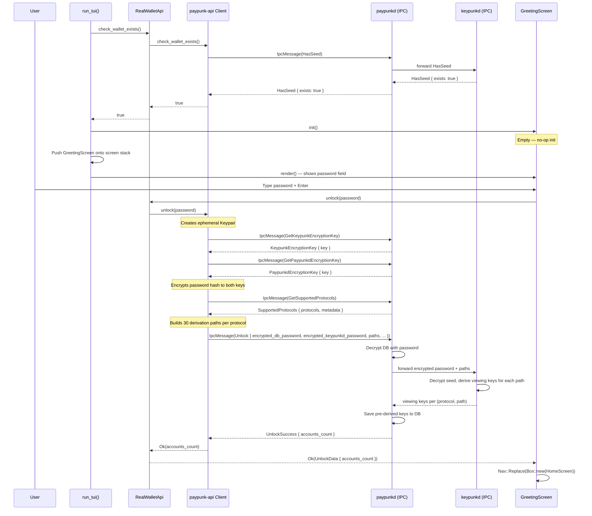

# GreetingScreen — Initial Unlock

**File:** `tui/src/screens/greeting.rs:16`

Shown when `check_wallet_exists()` returns `true` (existing wallet found). Prompts for password, then navigates to HomeScreen.

