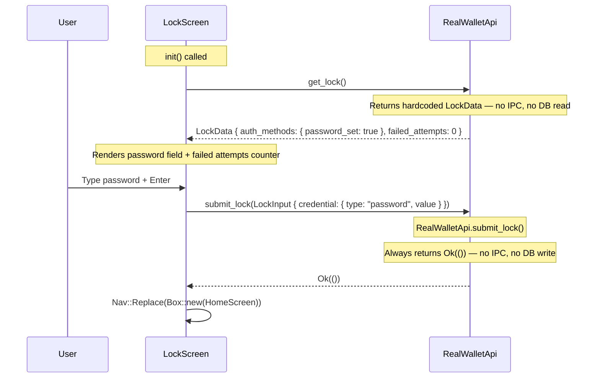

# LockScreen — Re-authentication

**File:** `tui/src/screens/lock.rs:17`

Shown after auto-lock timeout. User authenticates with password to return to HomeScreen.

**Persistence:** None. `get_lock()` returns hardcoded data (no DB read). `submit_lock()` is a no-op (no DB write). The screen exists only for the TUI-side lock UX — the daemon does not track lock state.

On error (password wrong), the screen stays visible and displays the error message. On `Esc`, it returns `Nav::Pop`.
