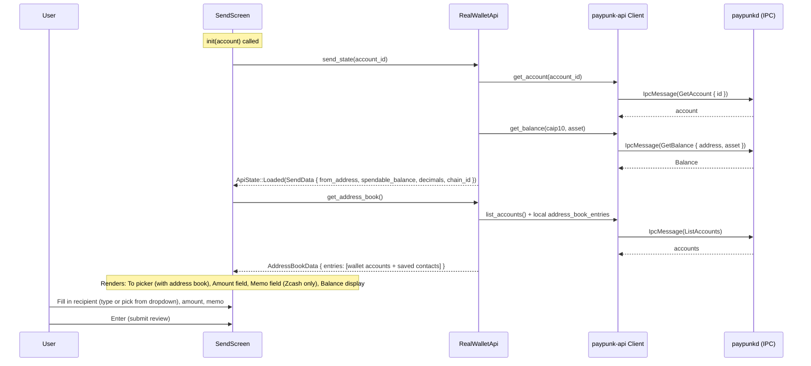
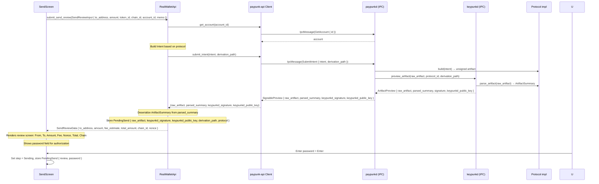
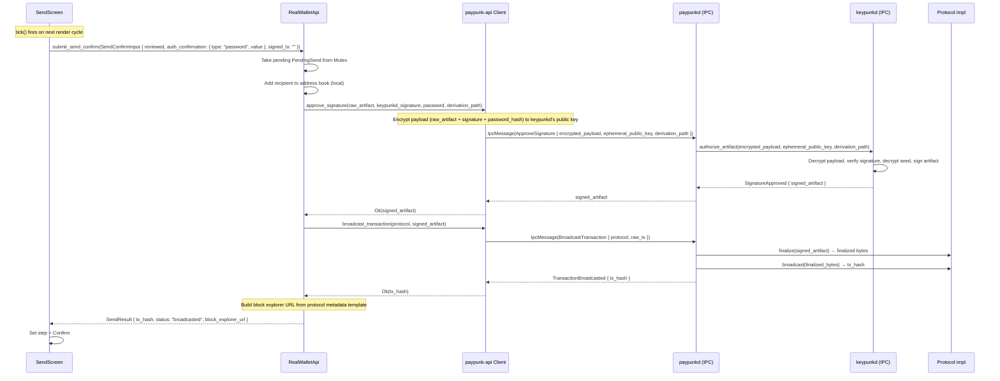
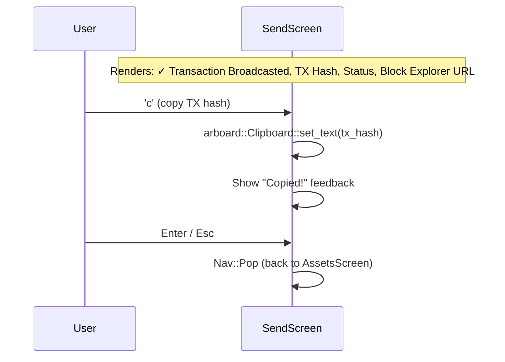

# SendScreen — Create and Send a Transfer

**File:** `tui/src/screens/send.rs:78`

Four-step flow: Form → Review → Sending → Confirm. This is the most complex usecase, spanning TUI → API → paypunkd → keypunkd with two-phase authorization.

## Step 1: Form (enter recipient, amount, memo)

## Step 2: Review (submit intent, show preview)

## Step 3: Sending (approve + broadcast, via tick)

## Step 4: Confirm (show result)

