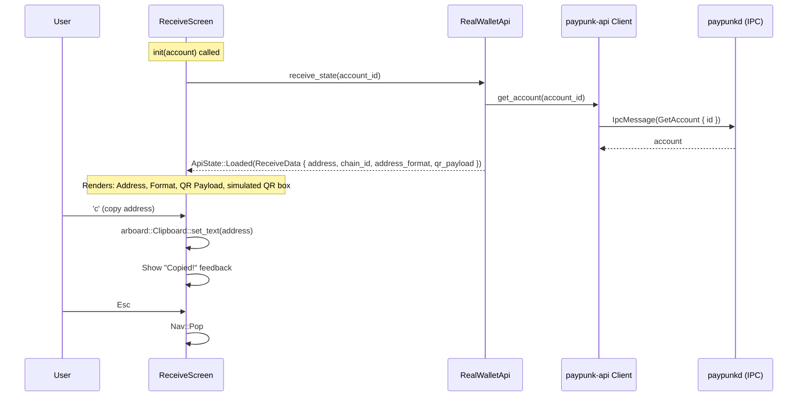
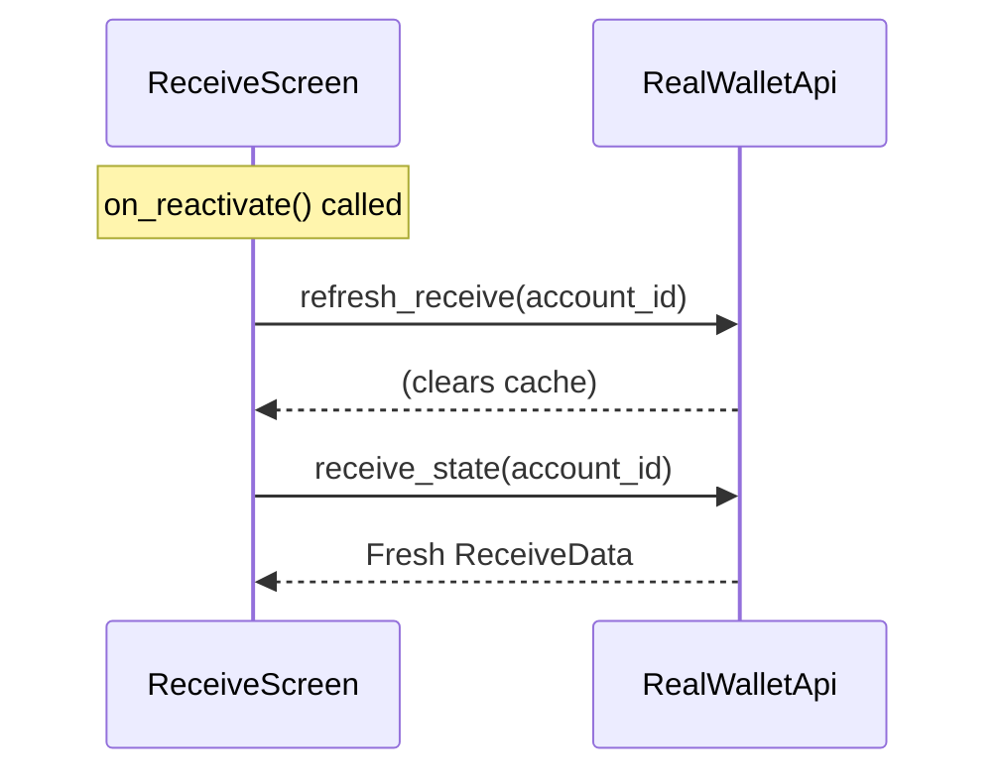

# ReceiveScreen — Display Receiving Address

**File:** `tui/src/screens/receive.rs:15`

Shows the account's receiving address, format info, QR payload, and a simulated QR code.

## Reactivation Flow

